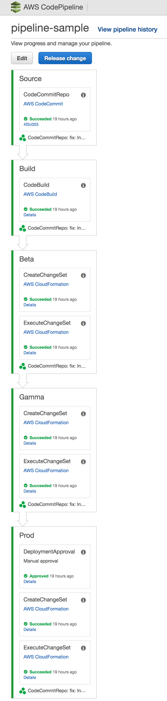

# Cookiecutter Pipeline for SAM based Serverless App

A cookiecutter template to create a 2-environment Pipeline for a NodeJS Serverless App based on [Serverless Application Model (SAM)](https://github.com/awslabs/serverless-application-model).



## Requirements

* [AWS SAM CLI](https://github.com/awslabs/aws-sam-cli)

## Usage

Generate a Pipeline template to your current project directory: `sam init --location gh:n1te1337/aws-sam-pipeline`

After generated you should have the following files:

```bash
├── Pipeline-Instructions.md <-- Information how to create this Pipeline
├── buildspec.yaml           <-- Sample CodeBuild spec with instructions on how to update it (in case you don't have one)
└── pipeline.yaml            <-- Cloudformation template that will generate this 2-environment pipeline
```

## Configuring GitHub Integration

This Pipeline is configured to look up for GitHub information stored on [EC2 System Manager Parameter Store](https://docs.aws.amazon.com/systems-manager/latest/userguide/systems-manager-paramstore.html) such as Branch, Repo, Username and OAuth Token.

Replace the placeholders with values corresponding to your GitHub Repo and Token:

```bash
PROJECT_NAME=<PROJECT_NAME>

aws ssm put-parameter \
    --name "/service/${PROJECT_NAME}/github/repo" \
    --description "Github Repository name for Cloudformation Stack ${PROJECT_NAME}-pipeline" \
    --type "String" \
    --value "GITHUB_REPO_NAME"

aws ssm put-parameter \
    --name "/service/${PROJECT_NAME}/github/token" \
    --description "Github Token for Cloudformation Stack ${PROJECT_NAME}-pipeline" \
    --type "String" \
    --value "TOKEN"

aws ssm put-parameter \
    --name "/service/${PROJECT_NAME}/github/user" \
    --description "Github Username for Cloudformation Stack ${PROJECT_NAME}-pipeline" \
    --type "String" \
    --value "GITHUB_USER"
```

**NOTE:** Keep in mind that these Parameters will only be available within the same region you're deploying this Pipeline stack. Also, if these values ever change you will need to [update these parameters](https://docs.aws.amazon.com/cli/latest/reference/ssm/put-parameter.html) as well as update the Cloudformation stack.

## Pipeline Creation

```bash
aws cloudformation create-stack \
    --stack-name ${PROJECT_NAME}-pipeline \
    --template-body file://pipeline.yaml \
    --capabilities CAPABILITY_NAMED_IAM
```

This may take a couple of minutes to complete, therefore give it a minute or two and then run the following command to retrieve the Git repository:

```bash
aws cloudformation describe-stacks \
    --stack-name ${PROJECT_NAME}-pipeline \
    --query 'Stacks[].Outputs'
```
